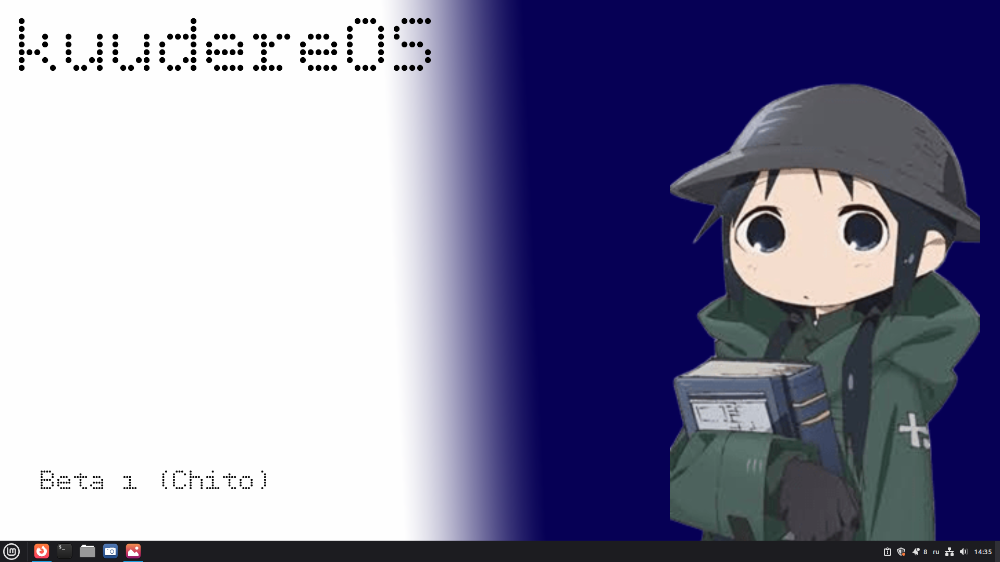
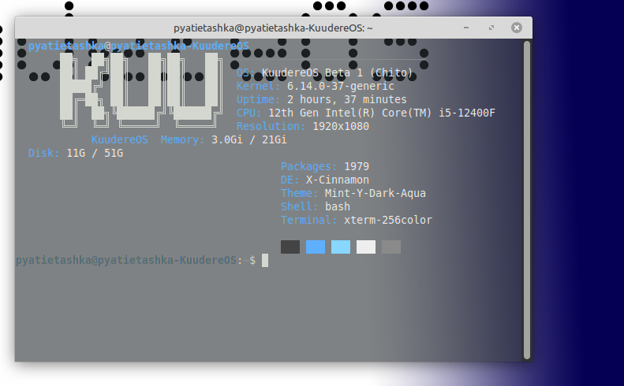
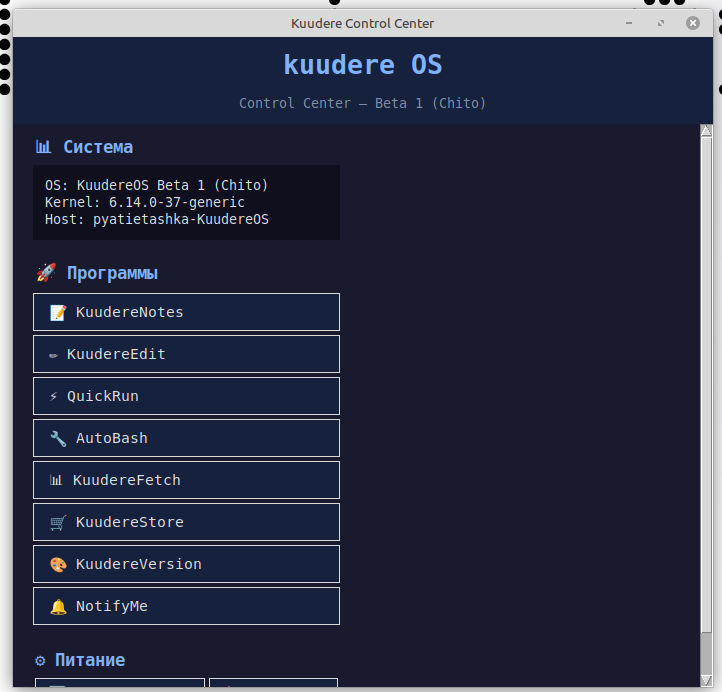
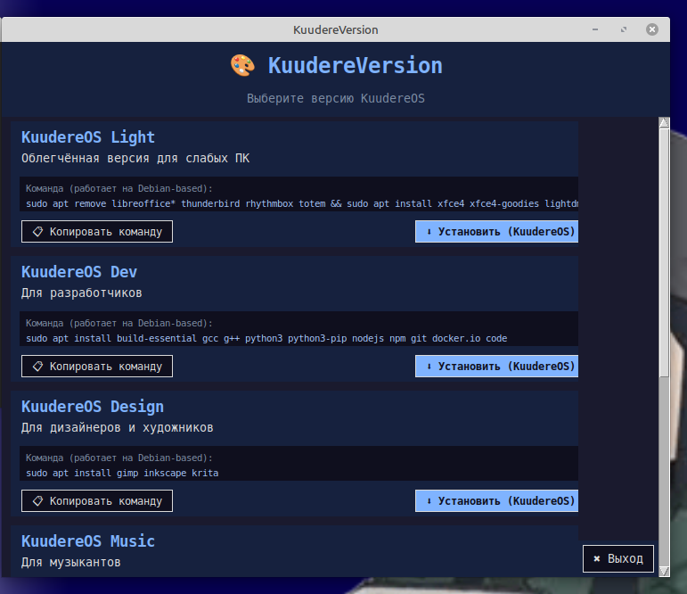
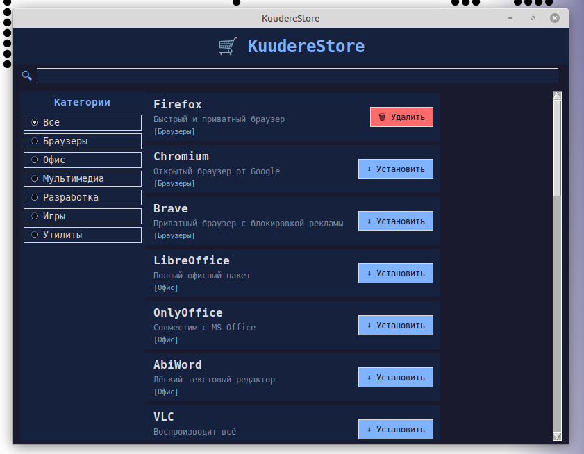
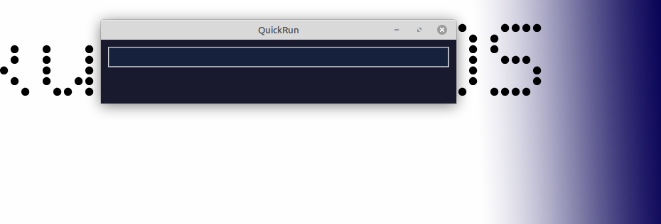
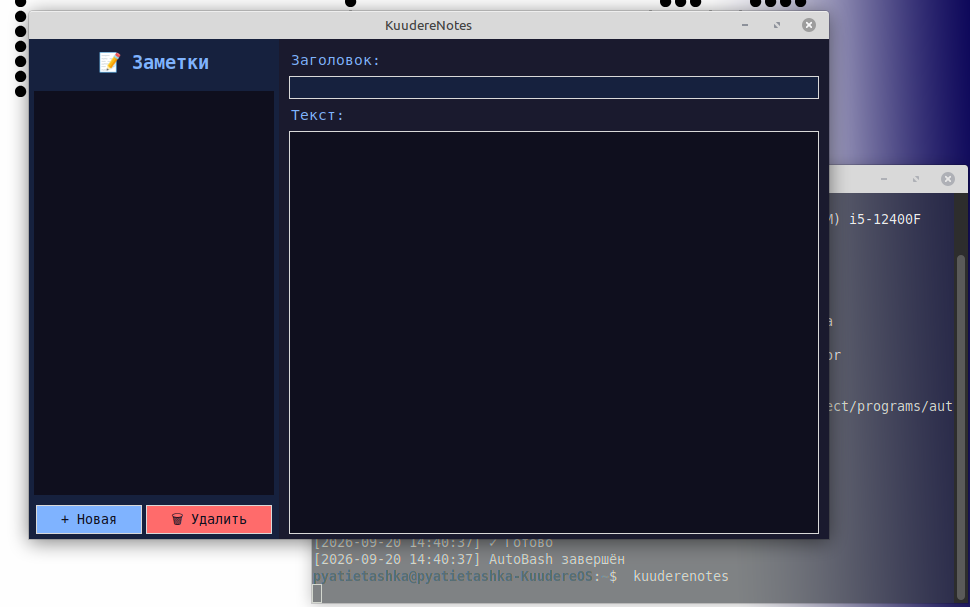
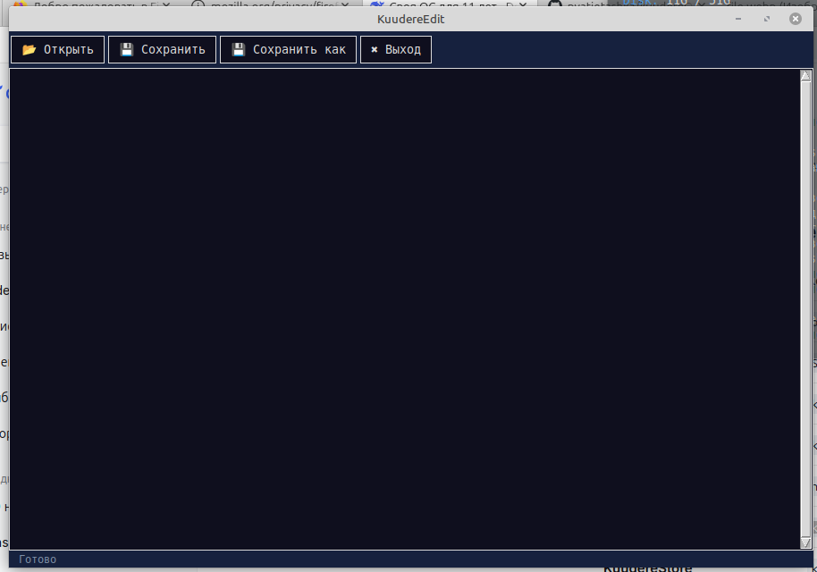
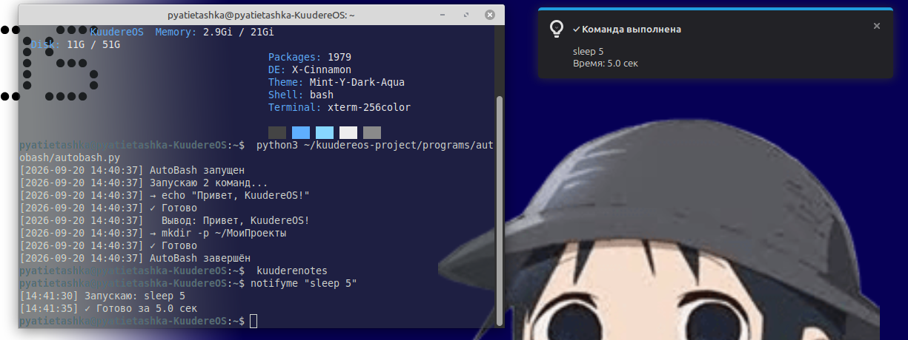
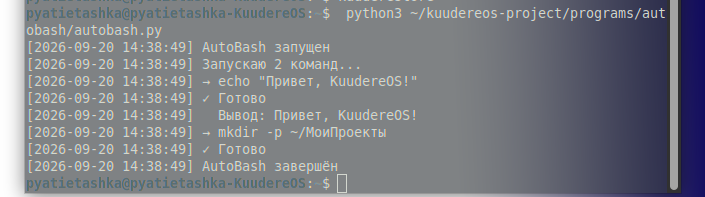

# KuudereOS

KuudereOS — операционная система на базе дистрибутива **Linux Mint**.
Создана для облегчения и автоматизации использования ОС.

## Философия

**Один ISO. Всё остальное — командами. Как Arch, но просто.**

## Версии

- **Stable** — базовая система
- **Light** — для слабых ПК
- **Dev** — для разработчиков
- **Design** — для дизайнеров
- **Music** — для музыкантов
- **3D** — для 3D-моделлеров
- **Studio** — всё сразу

## Программы

- **AutoBash** — запуск команд при старте
- **QuickRun** — быстрый запуск (как Win+R)
- **KuudereFetch** — информация о системе
- **KuudereNotes** — заметки
- **NotifyMe** — уведомления
- **KuudereEdit** — лёгкий редактор
- **KuudereStore** — магазин приложений
- **KuudereVersion** — магазин версий
- **Control Center** — центр управления

## Установка

Скачай ISO из раздела **Releases**.

## Скриншоты

### Рабочий стол

### KuudereFetch

### Control Center

### KuudereVersion

### KuudereStore

### QuickRun

### KuudereNotes

### KuudereEdit

### NotifyMe

### AutoBash

## Лицензия

GPL-3.0
